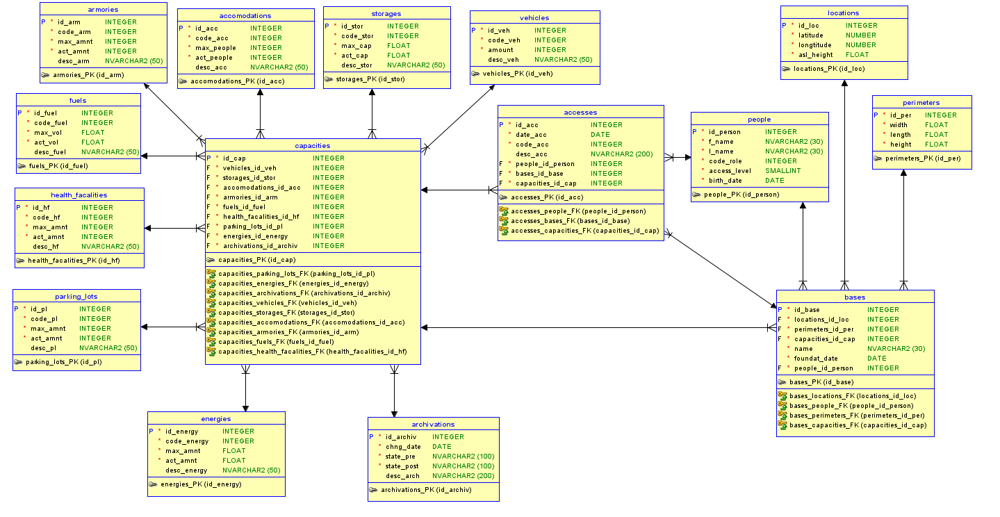
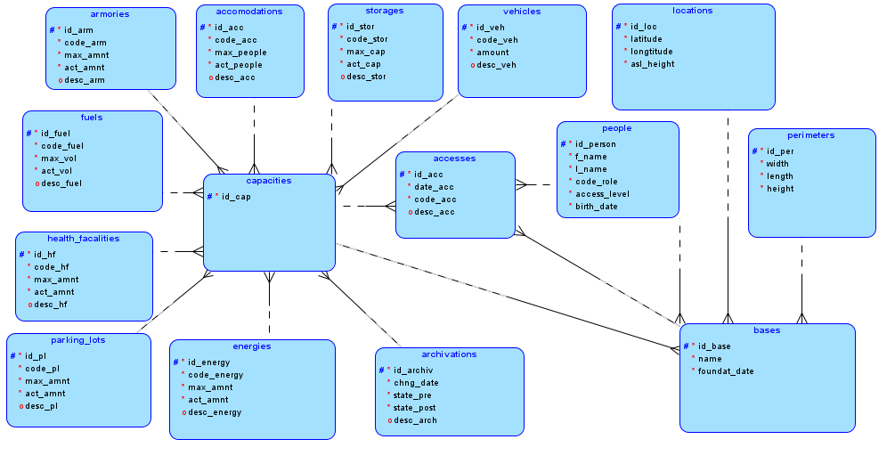

# DOKUMENTACE
Autoři: Martin Šilar, Neil Malhotra

## **Úvod**

##**E-R model**
E-R model databáze naleznete na obrázku: 

##**Logický model**
Logický model databáze naleznete na obrázku:

##**Entitní integrita**

##**Doménová integrita**

##**Referenční integrita**

##**Indexy?**

##**Import struktury databáze**

##**Import dat od zadavatele do databáze**

##**Požadavky na spuštění**

##**Postup instalace?**

##**Závěr**
